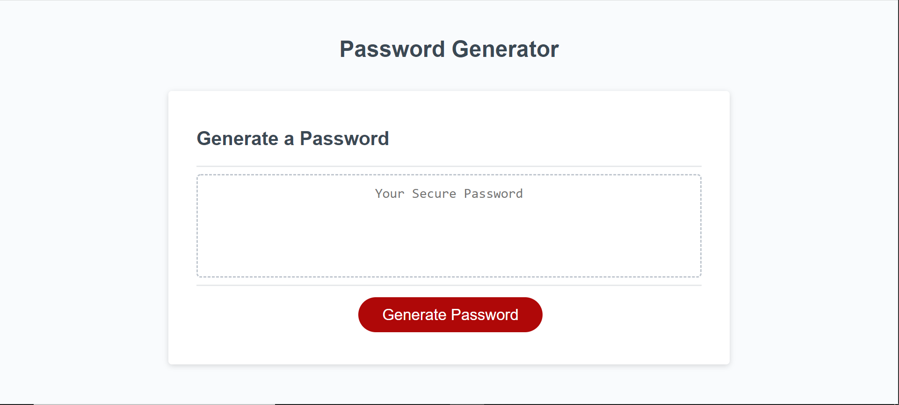

# Random Password Generator 

---
## Description of working Application:
***

1.  When user clicks on generate password, they are then displayed with a form. 

2.  User enters their desired random password length between 8-128 characters.

3.  When character length is confirmed, four new forms display asking user for their choice of lowercase leters, uppercase letters, special characters, and numbers.

4.  From selected character types, random password containing at least one of each character is displayed to user in related text section in center of application.

5.  Then, if user wants to generate a new password again after, they simply click generate password button again and application will begin selection process of password parameters before generating.

---
---
### Deployed Application Preview

## Links
---

+ **[Deployed Application Link](https://originator1.github.io/Random-PW-Generator/)**

+ **[Github Repository Link](www.github.com/Originator1)**

